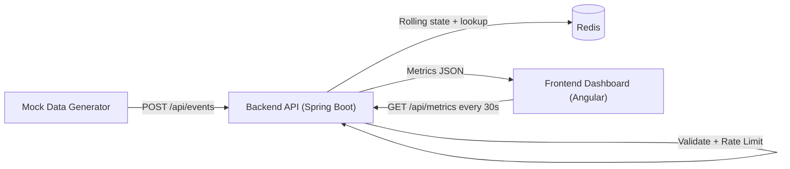

# Ecommerce Analytics

Real-time ecommerce analytics system with event ingestion, Redis-backed rolling aggregations, and a live dashboard.

## Project Structure

- `backend/`: Spring Boot API for ingestion + rolling metrics
- `frontend/`: Angular single-page dashboard
- `data-generator/`: Python mock event producer
- `docker-compose.yml`: orchestrates Redis, backend, frontend, generator

## Quick Start (Priority)

### Prerequisites

- Docker engine running (`docker info` should show a Server section)
- Docker Compose plugin (`docker compose version`)

### Start all services

```bash
cd /Users/shivaniagarwal/Downloads/analytics
docker compose up --build
```

### Access

- Frontend dashboard: `http://localhost:4200`
- Backend metrics API: `http://localhost:18080/api/metrics`

### Stop

```bash
docker compose down
```

## Architecture Overview (Priority)



Draw.io source file: [docs/ecommerce-analytics-flow.drawio](/Users/shivaniagarwal/Downloads/analytics/docs/ecommerce-analytics-flow.drawio)

### Data model and windows

- Active users: Redis sorted set, rolling 5-minute window
- Active sessions: Redis sorted set, rolling 5-minute window
- Page views by URL: event timeline + hash, rolling 15-minute window
- Sessions-for-same-user metric: maximum active sessions for any single user in last 5 minutes


## Event Contract

```json
{
  "timestamp": "2024-03-15T14:30:00Z",
  "user_id": "usr_789",
  "event_type": "page_view",
  "page_url": "/products/electronics",
  "session_id": "sess_456"
}
```

## API Documentation

### POST `/api/events`

Ingests one event.

Example:

```bash
curl -X POST http://localhost:18080/api/events \
  -H "Content-Type: application/json" \
  -d '{
    "timestamp":"2024-03-15T14:30:00Z",
    "user_id":"usr_789",
    "event_type":"page_view",
    "page_url":"/products/electronics",
    "session_id":"sess_456"
  }'
```

Responses:
- `202 Accepted` on success
- `400 Bad Request` on validation/malformed JSON
- `429 Too Many Requests` when rate limit is exceeded

### GET `/api/metrics`

Returns rolling metrics for dashboard.

Example:

```bash
curl http://localhost:18080/api/metrics
```

Sample response:

```json
{
  "activeUsers": 42,
  "activeSessions": 55,
  "activeSessionsForSameUser": 3,
  "referenceUserId": "usr_789",
  "topPages": [
    { "page": "/products/electronics", "count": 22 },
    { "page": "/offers", "count": 17 }
  ]
}
```

## Configuration

Backend environment variables:

- `REDIS_HOST` (default `redis` in compose)
- `REDIS_PORT` (default `6379`)
- `ANALYTICS_ACTIVE_WINDOW_SECONDS` (default `300`)
- `ANALYTICS_PAGE_WINDOW_SECONDS` (default `900`)
- `EVENTS_RATE_LIMIT_PER_SECOND` (default `100`)

Generator environment variables:

- `BACKEND_URL` (default `http://backend:8080/api/events`)
- `EVENTS_PER_SECOND` (default `100`)

## Code Quality and Testing Strategy

- Validation constraints are applied on DTO fields and enforced with `@Valid`.
- Centralized API exception handling returns consistent error payloads.
- Rate-limiting filter protects ingestion endpoint under load.
- Tests currently include:
  - DTO validation tests
  - Rate-limiter behavior tests
  - Controller endpoint tests (`POST /api/events`, `GET /api/metrics`)
  - Malformed JSON and validation error response tests
  - Service aggregation logic tests (rolling metrics + top pages)

Run tests:

```bash
cd /Users/shivaniagarwal/Downloads/analytics/backend
./mvnw test
```

## Performance and Reliability Notes

- Redis chosen for low-latency rolling aggregations.
- Time-window pruning keeps active sets bounded.
- Current rate limiter is in-memory and best for single backend instance.
- For multi-instance scaling, use shared/distributed rate limiting.

## Troubleshooting

- `Connection refused` from generator at startup: backend may still be booting; wait 10-20s.
- `404` on `localhost:8080`: another local service may already own 8080; this project uses host port `18080`.
- Confirm service health:

```bash
docker compose ps
docker compose logs --tail=200 backend
docker compose logs --tail=200 data-generator
```

## Future Improvements

- Distributed rate limiting via Redis/Bucket4j
- Stronger session modeling and deduplication semantics
- Historical analytics persistence and querying
- Load/performance test suite for sustained throughput
- AuthN/AuthZ for dashboard and ingestion endpoints
- Observability stack (Prometheus/Grafana/OpenTelemetry)
